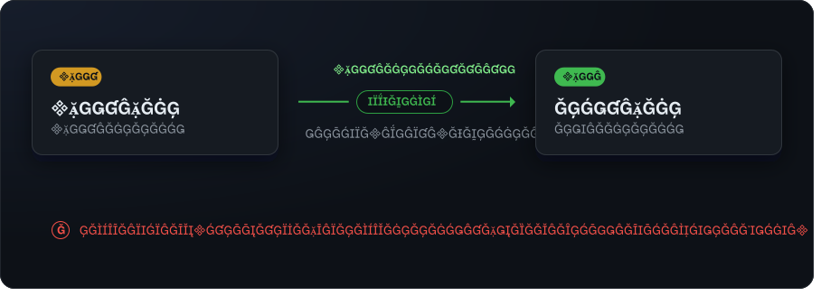

# pglite-migrate

Migrate [PGlite](https://github.com/electric-sql/pglite) data across PostgreSQL **major** versions (e.g. PG17 → PG18) — without native binaries or `pg_upgrade`.

PGlite is PostgreSQL compiled to WASM. Its data directory is a real PostgreSQL cluster, so when PGlite bumps the underlying Postgres major, an existing data directory can no longer be opened by the new engine. Native Postgres fixes this with `pg_upgrade`, but that needs native server binaries of *both* majors — which an embedded WASM database doesn't have.

`pglite-migrate` takes the **logical** route: it runs two PGlite engines side by side — the old engine on the source data, the new engine on the target — and transfers data between them at the SQL level. The on-disk format never has to be understood. No native binaries, no `pg_upgrade`.

<p align="center">
  
</p>

## Why you'd want this

A PG18 PGlite engine **physically cannot open** a PG17 data directory — that's the failure this library exists to bridge (and the e2e suite proves it on disk). `pglite-migrate` is the connective tissue for the PGlite, data-directory, cross-major case that the ecosystem doesn't otherwise cover.

- **Genuinely cross-major.** The test matrix runs a real **PG17 → PG18** migration (PGlite `0.4.x` → `0.5.x`), not a same-version round-trip.
- **App-driven or standalone.** Let your app create the target schema and just copy the data, *or* have pglite-migrate **reconstruct the app-class schema** from the source when there's no host app — schemas, tables, columns, sequences (with their start/increment/cycle and `OWNED BY` links), custom types, PK/FK/unique/check constraints, and indexes.
- **Custom types, not just enums.** Enums, **domains** (base type, default, `NOT NULL`, `COLLATE`, and every `CHECK`), **composite types**, and **range types** are all rebuilt, in a dependency-safe order — so a domain over an enum, or a range over a domain, lands correctly.
- **Fidelity-first transfer.** Rows move via PostgreSQL **`COPY` (text format)** with a per-table `INSERT` fallback, preserving `json`/`jsonb`, `numeric`, `bytea`, arrays and `timestamptz` exactly. Sequences are realigned with `setval` so the next inserted id is correct.
- **Handles the hard cases.** Foreign keys are topologically ordered so parents load before children, and **FK cycles** transfer correctly inside a deferred-constraint transaction.
- **Safe by construction.** Optional source **backup**, a **dry-run** that provably writes nothing, post-migration **validation** (row-count parity, sequence consistency, or full content digests), **idempotent re-runs** (`error` / `truncate` / `skip`), and an atomic write-new-then-rename **swap** primitive.
- **Bring only the new engine.** Opt in and pglite-migrate will **fetch the old engine** your data directory needs — pinned version, hash-verified against a checksum shipped in this package, cached between runs. No second alias to wire up.
- **Errors that tell you what to do.** Point the wrong engine at a data directory and you get the directory, both majors, the engine you named, and the exact `npm install` line that fixes it — instead of PGlite's opaque `failed to initialize properly`.
- **Nothing disappears quietly.** Anything outside the app-class scope line — views, matviews, triggers, functions, RLS policies, rules, comments, grants, extensions — is **detected and reported** during reconstruction, and `--on-unsupported error` refuses before touching the target.

## Install

```bash
npm install pglite-migrate @electric-sql/pglite
```

`@electric-sql/pglite` is a peer dependency — your app supplies the engine version(s). To open two majors at once, install both under npm aliases:

```bash
npm install pglite-old@npm:@electric-sql/pglite@0.4.6   # PG17
npm install pglite-new@npm:@electric-sql/pglite@0.5.4   # PG18
```

**Or let pglite-migrate fetch the old engine for you.** Typically your app bundles only the version it was built against — the *destination*. Which engine the *source* needs isn't a property of your app at all; it's a property of the data on the user's disk. So pglite-migrate can read the data directory's `PG_VERSION`, download the pinned engine for that major, verify it against a hash shipped in this package, and use it:

```ts
const source = await openDataDir('/path/to/old-data', 'pglite-old', {
  fetchMissingEngine: true,   // off by default
});
```

```bash
pglite-migrate ./old-data ./new-data --source-engine pglite-old --fetch-missing-engine
```

It's opt-in, an installed engine always wins, and the engine is cached for later runs (`--engine-cache ephemeral` to clean up instead). See [engine acquisition](docs/15-engine-acquisition.md).

## Quick start (library, app-driven)

The recommended path. Your app already knows how to create its own schema, so let it: create the schema on the new engine, then transfer the data.

```ts
import { migrate } from 'pglite-migrate';
import { PGlite as PGliteOld } from 'pglite-old'; // npm alias of the old version (PG17)
import { PGlite as PGliteNew } from 'pglite-new'; // npm alias of the new version (PG18)

const source = new PGliteOld('/path/to/old-data');
const target = new PGliteNew('/path/to/new-data');
await createSchema(target);        // your app's normal startup migrations

const report = await migrate({ source, target });   // validates row counts by default
console.log(`${report.totalRows} rows across ${report.tables.length} tables`);
```

No host app? Let pglite-migrate rebuild the schema from the source first:

```ts
const report = await migrate({ source, target, reconstructSchema: true });
// Out-of-scope objects (views, triggers, functions, RLS, partitioning) are
// reported in report.reconstruction.unsupported, never silently dropped.
```

The core never imports `@electric-sql/pglite` directly — it speaks to a minimal `PGliteLike` interface, which is exactly what lets you hand it two different majors at once.

## CLI

```bash
pglite-migrate <source-data-dir> <target-data-dir> [options]
```

| Option | Description |
| --- | --- |
| `--source-engine <pkg>` / `--target-engine <pkg>` | npm module/alias for each engine (default `@electric-sql/pglite`) |
| `--fetch-missing-engine` | Download a pinned engine when the named one is not installed (off by default) |
| `--engine-cache <mode>` | Retention for a downloaded engine: `keep` \| `ephemeral` (default `keep`) |
| `--engine-cache-dir <path>` | Where to store downloaded engines (default: an OS cache directory) |
| `--validate <level>` | Post-migration check: `off` \| `counts` \| `full` (default `counts`) |
| `--strict` | On validation failure, throw a `ValidationError` (default: report + exit non-zero) |
| `--on-existing <mode>` | Non-empty target: `error` \| `truncate` \| `skip` (default `error`) |
| `--reconstruct-schema` | Rebuild the source's app-class schema on an empty target first (alias `--standalone`) |
| `--on-unsupported <mode>` | With `--reconstruct-schema`, on out-of-scope objects: `warn` \| `error` (default `warn`) |
| `--dry-run` | Report the plan without writing anything |
| `--backup` / `--backup-dir <path>` | Back up the source data dir before migrating |
| `--keep <n>` | Retain at most `n` timestamped backups; prune the oldest (default: keep all) |

## Demos

Animated terminal captures of the real CLI against a live **PG17 → PG18** pair. Each
clip opens with a title card for the concept, then types the command and reveals its
**verbatim** output. Regenerate them any time with `npm run demo`.

<p align="center">
  
</p>

<p align="center">
  
</p>

<p align="center">
  
</p>

<p align="center">
  
</p>

<p align="center">
  
</p>

## Scope

**In scope — app-class schemas:** schemas, tables, columns (including generated/identity), sequences (with their defining parameters and ownership), custom types (enums, domains, composites, ranges), primary/foreign/unique/check constraints, and indexes; data fidelity for the common types.

**Out of scope — full `pg_dump` parity:** views, materialized views, partitioned and foreign tables, triggers, functions, RLS policies, rules, operator classes, collations, comments, grants, and extensions. During standalone reconstruction these are **detected and reported**, never silently dropped — and `--on-unsupported error` refuses before touching the target.

## How it compares

| Need | Tool |
| --- | --- |
| Migrate a *native* Postgres cluster, files in place | `pg_upgrade` (+ portable binaries via `embedded-postgres` / `zonkyio/embedded-postgres-binaries`) |
| Pure-JS schema introspection | [`pg-introspection`](https://www.npmjs.com/package/pg-introspection) |
| Pure-JS schema dump (DDL) | [`pg-schema-dump`](https://github.com/seveibar/pg-schema-dump) |
| **Migrate *PGlite* data across a major version** | **this package** |

## Documentation

Full requirements and design specs live in [`docs/`](./docs) (numbered for linear reading). Start with [`docs/1-overview.md`](./docs/1-overview.md) and [`docs/ARCHITECTURE.md`](./docs/ARCHITECTURE.md); the per-feature specs (COPY-text transfer, FK cycles, standalone reconstruction, backup, atomic swap, dry-run, validation, idempotence, engine acquisition, custom types, range types) are docs 7–17.

## License

MIT
